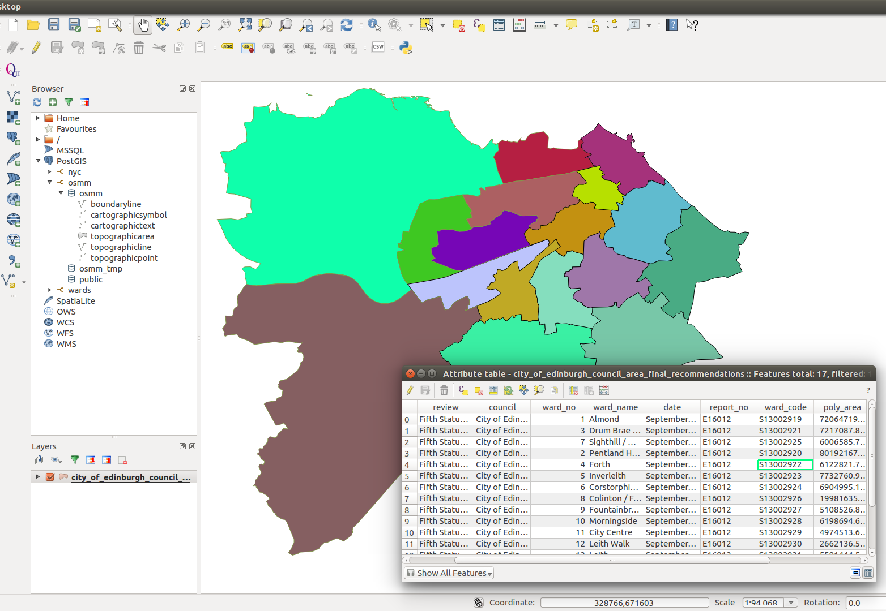

# Unit testing with Postgis.
 > Using a dockerized postgis container with integrated Junit and Spring boot support.
 
Quick start
------------
  * Ensure you have docker installed for testcontainers framework.(From https://www.testcontainers.org/usage.html
                                      “Docker or docker-machine (for OS X) must be installed on the machine you are running tests on. TestContainers currently requires JDK 1.8 and is compatible with JUnit.
                                      +
                                      If you want to use TestContainers on Windows you can try the alpha release.”
                                      Set up the dependencies.)
  
 Installing Docker if not installed
 ------------
 A quick way of installing the latest docker on linux. (or see https://www.docker.com)
 ~~~
 curl -fsSL https://get.docker.com/ | sh
 ~~~
 Add the connected user "$USER" to the docker group. So you don't have to use sudo for docker commands
 
 ~~~
sudo gpasswd -a $USER docker
sudo service docker start
 ~~~
 
 Test Docker
 ~~~
 docker run hello-world
  ~~~
  Should produce something like this

  ~~~
   Hello from Docker!
   This message shows that your installation appears to be working correctly.
  ~~~
### Run the tests

~~~
git clone git@github.com:murrayk/postgis-integration-test-example.git
cd postgis-integration-test-example
./gradlew clean build test 
~~~

# About this Example
A major problem with unit testing with a lot of gis work, is that quite a lot of the heavy lifting is done with specialist database extensions (Postgis in this in this example). 

If we take a typical simple GIS problem case like the following. 
We have the centroid of a building and we would like to know what authority ward is in charge of it.

Dataset viewed in QGIS


However the actual meat of the work would be carried out in a spatial analysis query like this. 

```sql
"SELECT ward_name " +
       " FROM areas.city_of_edinburgh_council_area" +
       " WHERE ST_Contains(geom, ST_SetSRID(ST_MakePoint(?,?), 27700));",
```
It previously was very difficult to add integration tests for this to the CI pipeline. Having the shared jenkins test db in a known consistent state for the tests to work
Plus making sure the tests weren’t running in parallel, so tear down/setup steps weren’t corrupting.

Sometimes you could stub the database layer but it overlooks that actually much of the logic of entire app is encapsulated in these spatial queries. And hope that the query and stub behaviour are kept in sync.


I was looking into using docker to create a postgis image. However someone has already created good version already. https://hub.docker.com/r/mdillon/postgis/

>“The mdillon/postgis image provides a Docker container running Postgres 9 or 10 with PostGIS 2.4installed. This image is based on the official postgres image and provides variants for each version of Postgres 9 supported by the base image (9.3-9.6) and Postgres 10.”

So you can choose docker image that matches your production setup.


The next step was to try and hook it up to into our unit testing framework.

I came across testcontainers(https://github.com/testcontainers/testcontainers-java). The testcontainer project has wide range of docker based to aid testing they also provides great integration code with junit. They don’t support postgis directly but substituting  their default postgres with a  mdillon/postgis image will work.


You can then spin a the exact same database as production in a consistent state using controlled by flyway scripts for example.

### Analysis of the Dao Test

```java 
@RunWith(SpringRunner.class)
public class TestWardDao {
```
>> Test containers uses a junit rule to create the docker container to use. This is where we specify our postgis docker image tag. 
```java
    @Rule
    public PostgreSQLContainer postgres = new PostgreSQLContainer("mdillon/postgis:9.5");
```
>> We can use a test fixture to load in our base polygons for consistency in the test-fixtures.sql
```java
    @Value(value = "classpath:/db/sql/test-fixture.sql")
    private Resource testFixtureResource;

    private WardDao wardDao;

    @Before
    public void setup() throws SQLException {
        flywayCreateFreshSchema();
        areasTestFixture();
        wardDao = new WardDao(postGisDocker());
    }

    @Test
    public void testFindWardOfBuilding(){
        BritishGridPoint pointInPentlandsWard = new BritishGridPoint(319426,670158);

        List<String> result = wardDao.findWardsForBuilding(pointInPentlandsWard);
        Assert.assertEquals("point in pentlands ward", "Pentland Hills", result.get(0));

    }
```
>> Create a data source for our DAO from our docker container that was created using the junit rule
```java  
    DataSource postGisDocker() {
        return DataSourceBuilder
                .create()
                .username(postgres.getUsername())
                .password(postgres.getPassword())
                .url(postgres.getJdbcUrl())
                .driverClassName(postgres.getDriverClassName())
                .build();

    }
```
>> Load the areas test fixture 
```java  
    private void areasTestFixture() throws SQLException {
        ScriptUtils.executeSqlScript(postGisDocker().getConnection(), testFixtureResource);
    }
```
>> Using the main project flyway scripts for testing. 

>>This recreates the  database schema from scratch for each test.
It is clear at all times what state a database is in and is the same version you are using in production.
```java    
    private void flywayCreateFreshSchema() {
        Flyway flyway = new Flyway();
        flyway.setDataSource(postGisDocker());
        flyway.setSchemas("areas");
        flyway.migrate();
    }
}    
```

